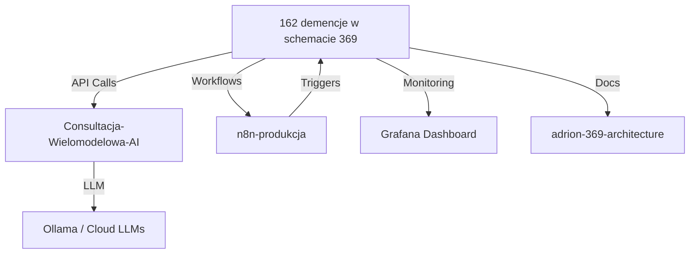

# 📚 ADRION 369 — Complete Project Index

**Generated:** 2026-05-14 19:57 UTC

## 🎯 Quick Navigation

### 🔥 Production Systems

| Project | Status | Purpose | Quick Start |
|---------|--------|---------|------------|
| [162 demencje w schemacie 369](../../PROJEKTY/162%20demencje%20w%20schemacie%20369/README.md) | 🔴 ACTIVE | Main Platform | `docker-compose up -d` |
| [Consultacja-Wielomodelowa-AI](../../PROJEKTY/Consultacja-Wielomodelowa-AI/README.md) | 🟢 ACTIVE | Multi-Model API | `docker-compose up -d` |
| [n8n-produkcja](../../PROJEKTY/n8n-produkcja/README.md) | 🟢 ACTIVE | Workflows | `docker-compose up -d` |

### 📚 Documentation & Reference

| Project | Type | Status |
|---------|------|--------|
| [adrion-369-architecture](../../PROJEKTY/adrion-369-architecture/README.md) | Docs | 📄 Reference |
| [leadgen-comet-pipeline](../../PROJEKTY/leadgen-comet-pipeline/README.md) | Module | 🟡 Stable |
| [embedding-ab-test-framework](../../PROJEKTY/embedding-ab-test-framework/README.md) | Testing | 🟡 Stable |
| [kyc-provider-integration-guide](../../PROJEKTY/kyc-provider-integration-guide/README.md) | Integration | 🟡 Stable |

## 🏗️ Architecture Overview



## 📡 Port Map

| Service | Port | Project | URL |
|---------|------|---------|-----|
| **Nginx Ingress** | 80, 443 | Main | http://localhost |
| **API (Arbitrage)** | 8001 | Main | http://localhost:8001 |
| **Backend** | 8002 | Main | http://localhost:8002 |
| **Vortex Engine** | 8003 | Main | http://localhost:8003 |
| **Consultacja API** | 8000 | Consultacja | http://localhost:8000 |
| **n8n UI** | 5678 | n8n | http://localhost:5678 |
| **Grafana** | 3000 | Monitoring | http://localhost:3000 |
| **PostgreSQL** | 5432 | Database | localhost:5432 |
| **Ollama** | 11434 | LLM | http://localhost:11434 |

## 🚀 Common Commands

### Start All Services
```bash
cd "PROJEKTY/162 demencje w schemacie 369"
docker-compose -f docker-compose-orchestration.yml up -d
```

### Monitor Services
```bash
docker-compose ps
docker-compose logs -f --tail=100
```

### Access Dashboards
- Grafana: http://localhost:3000 (admin/admin)
- n8n: http://localhost:5678
- API Docs: http://localhost:8001/docs

### Database Access
```bash
psql -h localhost -U adrion -d genesis_record -p 5432
```

## 📊 Metrics & Monitoring

- **Grafana**: http://localhost:3000
- **Prometheus**: http://localhost:9090
- **Loki Logs**: Integrated in Grafana
- **Dashboard**: See [DevOps Dashboard](../../PROJEKTY/adrion-deploy/grafana/provisioning/dashboards/devops-dashboard.json)

## 🔗 Dependencies Graph

```
Tier 0 (Foundation)
  └─ PostgreSQL

Tier 1 (Infrastructure)
  ├─ Loki (Logs)
  └─ Promtail (Log Shipper)

Tier 2 (Core Engines)
  ├─ n8n (Workflows)
  ├─ Vortex Engine (Orchestration)
  ├─ Adrion Healer (Self-Healing)
  └─ Ollama (LLM)

Tier 3 (APIs & Services)
  ├─ Arbitrage API
  ├─ Backup Automation
  └─ Alert Handler

Tier 4 (Observability)
  ├─ Grafana
  └─ Nginx Reverse Proxy
```

## 🐛 Troubleshooting

### Services Won't Start?
```bash
docker-compose down -v
docker-compose up -d
```

### Database Connection Error?
```bash
docker-compose logs postgres
docker exec adrion-postgres pg_isready
```

### Out of Memory?
```bash
docker system prune -a
docker volume prune
```

## 📞 Support

- 📖 [Full Documentation](../../PROJEKTY/adrion-369-architecture/)
- 🐛 [Report Issues](https://github.com/[owner]/162-demencje-369/issues)
- 💬 [Discussions](https://github.com/[owner]/162-demencje-369/discussions)

---

**Last Generated**: 2026-05-14 19:57 UTC
**Status**: All systems operational ✅
