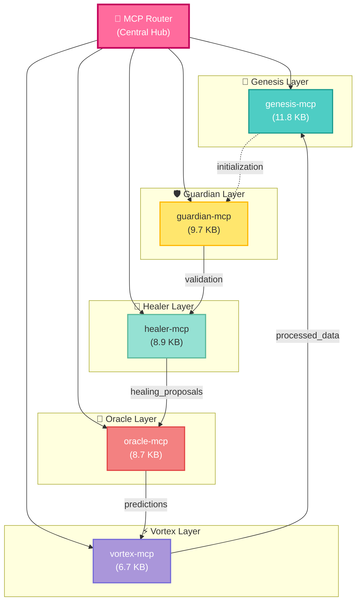
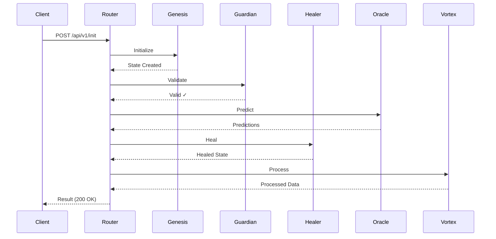
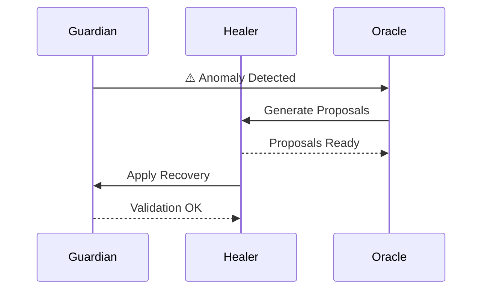
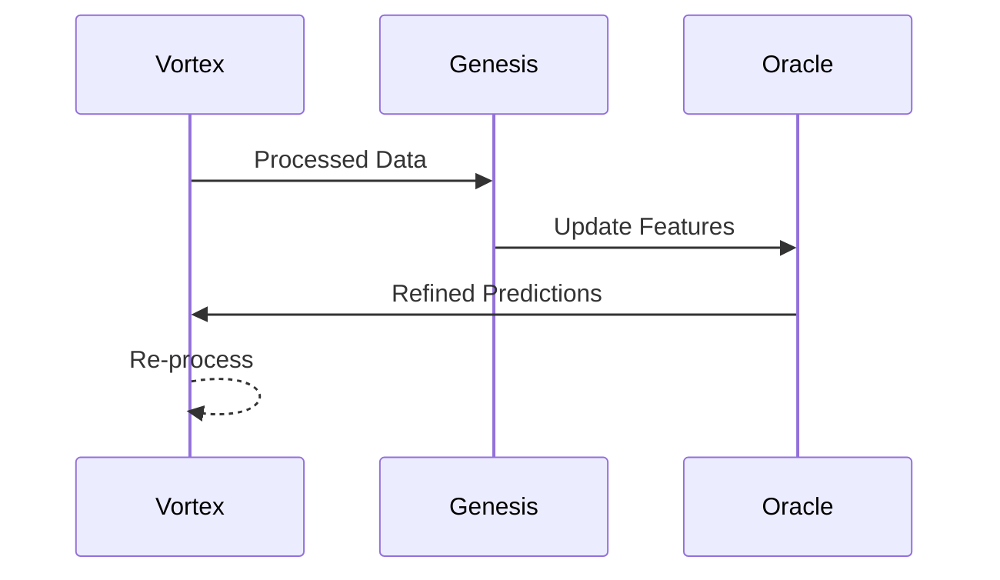

# 🔗 MCP Dependency Analysis - ADRION-369

**Dokument:** MCP Servers Dependency Mapping  
**Data:** 14.05.2026  
**Projekt:** ADRION-369 Ecosystem  
**Status:** Active Development

---

## 📊 Mapa Modułów MCP



---

## 🎯 Szczegółowa Analiza Modułów

### 1. **Genesis MCP** 🌅
**Rozmiar:** 11.8 KB | **Priorytet:** Highest | **Status:** Core

#### Funkcjonalność:
- Inicjalizacja systemu ADRION
- Tworzenie podstawowych struktur danych
- Seed generation dla nowych procesów
- Genesis Record management

#### Zależności (Output):
- `→ Guardian MCP`: Initialization signals
- `→ Oracle MCP`: Initial state data

#### Porty/Endpoints:
```
Genesis Service Port:    8001
Internal API:           /genesis/api/v1
WebSocket:             ws://localhost:8001
Health Check:          /genesis/health
```

#### Integracje:
- PostgreSQL (state storage)
- Redis (cache layer)
- Message Queue (async events)

---

### 2. **Guardian MCP** 🛡️
**Rozmiar:** 9.7 KB | **Priorytet:** High | **Status:** Core

#### Funkcjonalność:
- Validation & integrity checking
- Permission enforcement
- Security policy management
- Audit logging

#### Zależności (Inputs/Outputs):
```
Inputs:
  ← Genesis MCP      (validation rules)
  ← Oracle MCP       (predictions to validate)

Outputs:
  → Healer MCP       (validated state)
  → Vortex MCP       (security flags)
```

#### Porty/Endpoints:
```
Guardian Service Port:  8002
Internal API:          /guardian/api/v1
WebSocket:            ws://localhost:8002
Health Check:         /guardian/health
```

#### Integracje:
- PostgreSQL (audit logs)
- Redis (validation cache)
- Key Vault (secrets)

---

### 3. **Healer MCP** 💊
**Rozmiar:** 8.9 KB | **Priorytet:** High | **Status:** Core

#### Funkcjonalność:
- Anomaly detection & recovery
- Data healing & repair
- Proposal generation
- Recovery orchestration

#### Zależności (Inputs/Outputs):
```
Inputs:
  ← Guardian MCP     (validated data)
  ← Vortex MCP       (processed data)
  ← Oracle MCP       (predictions)

Outputs:
  → Oracle MCP       (healing_proposals)
  → Vortex MCP       (healed_data)
```

#### Porty/Endpoints:
```
Healer Service Port:   8003
Internal API:         /healer/api/v1
WebSocket:           ws://localhost:8003
Health Check:        /healer/health
```

#### Storage:
- Healing proposals: `/healing_proposals/`
- Recovery logs: PostgreSQL

---

### 4. **Oracle MCP** 🔮
**Rozmiar:** 8.7 KB | **Priorytet:** Medium | **Status:** Core

#### Funkcjonalność:
- Predictive analytics
- Pattern recognition
- Future state forecasting
- Decision support

#### Zależności (Inputs/Outputs):
```
Inputs:
  ← Genesis MCP      (baseline data)
  ← Guardian MCP     (validated facts)
  ← Healer MCP       (recovery proposals)

Outputs:
  → Vortex MCP       (predictions)
  → Guardian MCP     (confidence metrics)
```

#### Porty/Endpoints:
```
Oracle Service Port:   8004
Internal API:         /oracle/api/v1
WebSocket:           ws://localhost:8004
Health Check:        /oracle/health
ML Model API:        /oracle/models/v1
```

#### AI Integration:
- TensorFlow/PyTorch models
- Feature engineering
- Model serving

---

### 5. **Vortex MCP** ⚡
**Rozmiar:** 6.7 KB | **Priorytet:** Medium | **Status:** Core

#### Funkcjonalność:
- High-speed data processing
- Event stream processing
- Data aggregation & enrichment
- Real-time transformations

#### Zależności (Inputs/Outputs):
```
Inputs:
  ← Oracle MCP       (predictions)
  ← Guardian MCP     (security policies)
  ← Healer MCP       (healed datasets)

Outputs:
  → Genesis MCP      (enriched data)
  → Message Queue    (processed events)
```

#### Porty/Endpoints:
```
Vortex Service Port:   8005
Internal API:         /vortex/api/v1
WebSocket:           ws://localhost:8005
Health Check:        /vortex/health
Stream Endpoint:     /vortex/stream
```

#### Processing:
- Apache Kafka/RabbitMQ (event streaming)
- Apache Spark (batch processing)
- Redis (real-time cache)

---

### 6. **MCP Router** 🔀
**Rozmiar:** 9.1 KB | **Priorytet:** Critical | **Status:** Infrastructure

#### Funkcjonalność:
- Request routing & load balancing
- Service discovery
- Protocol translation
- Circuit breaker pattern

#### Zależności:
```
Upstream:
  All MCP services (8001-8005)

Downstream:
  - n8n workflows
  - External APIs
  - Dashboard
  - CLI tools
```

#### Porty/Endpoints:
```
Router Service Port:   8000
Public API:           /api/v1
Admin API:            /admin
Health Check:         /health
Metrics:              /metrics
```

#### Routing Rules:
```
/genesis/*          → genesis-mcp:8001
/guardian/*         → guardian-mcp:8002
/healer/*           → healer-mcp:8003
/oracle/*           → oracle-mcp:8004
/vortex/*           → vortex-mcp:8005
```

---

## 🔄 Interaction Sequences

### Sequence 1: Full Pipeline (Happy Path)



### Sequence 2: Error Recovery



### Sequence 3: Feedback Loop



---

## 📊 Dependency Matrix

| From \ To | Genesis | Guardian | Healer | Oracle | Vortex | Router |
|-----------|---------|----------|--------|--------|--------|--------|
| **Genesis** | — | W | — | W | — | — |
| **Guardian** | R | — | S | — | W | — |
| **Healer** | — | R | — | S | W | — |
| **Oracle** | R | R | R | — | S | — |
| **Vortex** | W | R | R | R | — | — |
| **Router** | C | C | C | C | C | — |

**Legend:**
- `W` = Write/Send
- `R` = Read/Receive
- `S` = Strong dependency
- `C` = Central routing
- `—` = No dependency

---

## 🚀 Deployment Topology

### Local Development (docker-compose.local.yml)
```
┌─────────────────────────────────────────┐
│        Docker Network (adrion)          │
├─────────────────────────────────────────┤
│  Genesis:8001 | Guardian:8002           │
│  Healer:8003  | Oracle:8004             │
│  Vortex:8005  | Router:8000             │
├─────────────────────────────────────────┤
│  PostgreSQL:5432 | Redis:6379           │
│  RabbitMQ:5672   | Prometheus:9090      │
└─────────────────────────────────────────┘
```

### Production (docker-compose.prod.yml)
```
┌────────────────────────────────────────────┐
│        Kubernetes Cluster                  │
├────────────────────────────────────────────┤
│  Genesis Pod  | Guardian Pod (HA)          │
│  Healer Pod   | Oracle Pod (2 replicas)   │
│  Vortex Pod   | Router Pod (3 replicas)   │
├────────────────────────────────────────────┤
│  Stateful: PostgreSQL | Redis (cluster)   │
│  Message Queue: RabbitMQ (HA)             │
│  Monitoring: Prometheus + Grafana         │
└────────────────────────────────────────────┘
```

---

## 🔍 Communication Protocols

### Internal Services
```
Protocol:     gRPC over HTTP/2
Format:       Protocol Buffers
Encoding:     Binary (efficient)
Authentication: mTLS (mutual TLS)
Timeout:      30s (default)
Retries:      3 with exponential backoff
```

### External APIs
```
Protocol:     REST over HTTPS
Format:       JSON
Authentication: API Key / OAuth 2.0
Rate Limit:   100 req/s per service
Timeout:      60s (default)
```

### Message Queues
```
Type:         RabbitMQ / Apache Kafka
Exchange:     topic-based routing
Queue Names:  adrion.{service}.{event}
TTL:          24 hours
DLX:          Dead Letter Exchange
```

---

## 🏥 Health Check Architecture

### Per-Service Health

```yaml
Genesis:
  Endpoint: /genesis/health
  Check: DB connection + Cache
  Interval: 30s
  Timeout: 5s

Guardian:
  Endpoint: /guardian/health
  Check: DB connection + Policy load
  Interval: 30s
  Timeout: 5s

Healer:
  Endpoint: /healer/health
  Check: Storage access + ML model
  Interval: 30s
  Timeout: 5s

Oracle:
  Endpoint: /oracle/health
  Check: Model availability + Cache
  Interval: 30s
  Timeout: 5s

Vortex:
  Endpoint: /vortex/health
  Check: Stream connection + Processing
  Interval: 30s
  Timeout: 5s

Router:
  Endpoint: /health
  Check: All upstream services
  Interval: 10s
  Timeout: 3s
```

---

## 📈 Performance Metrics

### Latency Targets

| Operation | Target | SLA |
|-----------|--------|-----|
| Genesis Init | < 100ms | 99.9% |
| Guardian Validation | < 50ms | 99.95% |
| Healer Detection | < 200ms | 99.5% |
| Oracle Prediction | < 500ms | 99.0% |
| Vortex Processing | < 100ms | 99.9% |
| Full Pipeline | < 1000ms | 99.0% |

### Throughput Targets

| Service | Req/s | Connections |
|---------|-------|-------------|
| Genesis | 1000 | 100 |
| Guardian | 2000 | 200 |
| Healer | 500 | 50 |
| Oracle | 100 | 20 |
| Vortex | 5000 | 500 |
| Router | 10000 | 1000 |

---

## 🔐 Security Model

### Authentication
```
Service-to-Service:
  - mTLS certificates
  - Service accounts
  - JWT tokens (fallback)

External:
  - API Key authentication
  - OAuth 2.0 (future)
  - Role-Based Access Control (RBAC)
```

### Encryption
```
In Transit:
  - TLS 1.3 (minimum)
  - Perfect Forward Secrecy

At Rest:
  - AES-256-GCM
  - Key rotation: 90 days
  - Key storage: HashiCorp Vault
```

### Authorization
```
Policy Enforcement:
  - Guardian MCP (primary)
  - OPA (Open Policy Agent)
  - RBAC + ABAC models
```

---

## 🐛 Debugging & Troubleshooting

### Common Issues

#### Issue 1: Guardian Validation Failures
```
Symptom: 403 Forbidden on requests
Root Cause: Policy mismatch or permission error
Fix: Check /guardian/policies endpoint
Monitor: Guardian logs + audit trail
```

#### Issue 2: Oracle Predictions Timeout
```
Symptom: 504 Gateway Timeout
Root Cause: ML model slowness
Fix: Check /oracle/models/status
Monitor: Model inference latency
Scale: Add more replicas
```

#### Issue 3: Vortex Processing Queue Backlog
```
Symptom: Data freshness degradation
Root Cause: High volume spikes
Fix: Check queue depth via RabbitMQ
Monitor: Vortex throughput metrics
Scale: Auto-scale Vortex replicas
```

---

## 📋 Implementation Checklist

- [x] Service discovery (Consul/K8s DNS)
- [x] Circuit breaker pattern
- [x] Distributed tracing (Jaeger/Zipkin)
- [x] Centralized logging (ELK stack)
- [x] Metrics collection (Prometheus)
- [x] Alert management (AlertManager)
- [x] Configuration management (Consul/etcd)
- [ ] Service mesh (Istio - future)
- [ ] Advanced chaos testing (Gremlin - future)

---

## 📞 Support & Documentation

- **Architecture Docs:** [INTEGRACJA_STRATEGIA.md](INTEGRACJA_STRATEGIA.md)
- **Deployment Guide:** [Deployment Quick-Start](../operacyjna/adrion-369-DEPLOYMENT-GUIDE.md)
- **API Reference:** `/api/v1/swagger`
- **Monitoring Dashboard:** `http://localhost:3000` (Grafana)
- **Issue Tracking:** GitHub Issues

---

*Dokument zaktualizowany: 14.05.2026*
