# 🎨 ADRION-369 Visualizations & Diagrams

**Dokument:** Visual Architecture & Dependency Diagrams  
**Data:** 14.05.2026  
**Format:** Mermaid.js  

---

## 1️⃣ MCP Services Dependency Graph

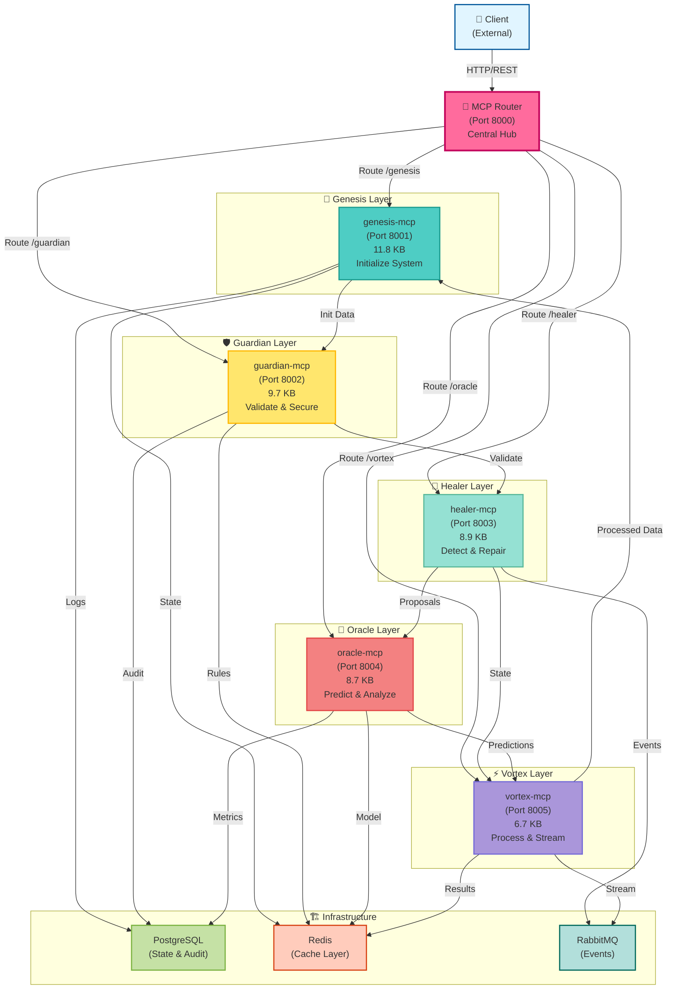

---

## 2️⃣ Request Flow Through Pipeline

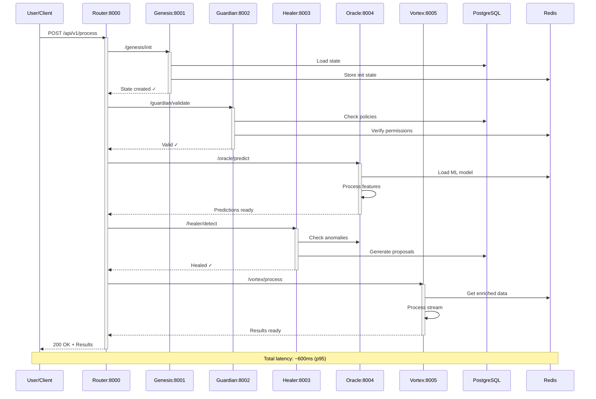

---

## 3️⃣ Deployment Architecture

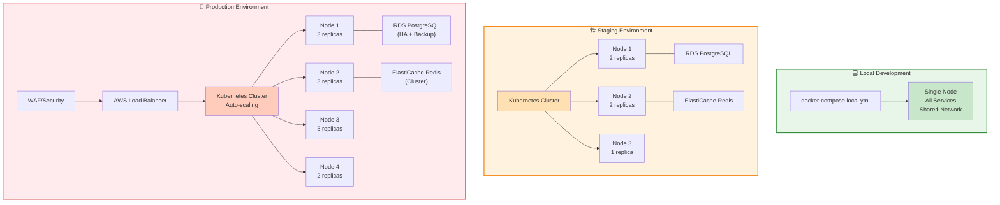

---

## 4️⃣ Test Coverage Distribution

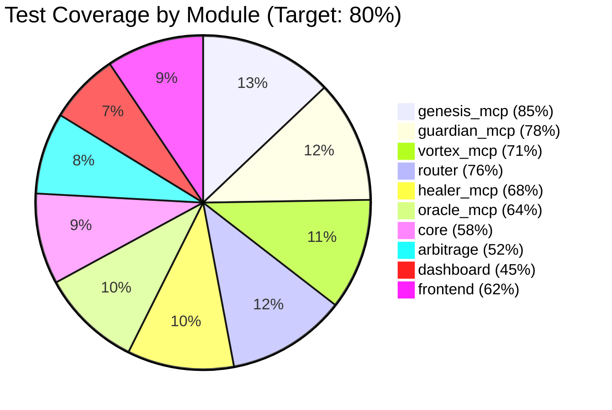

---

## 5️⃣ Code Complexity Heatmap

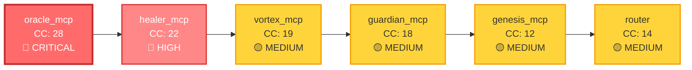

---

## 6️⃣ Performance Metrics Timeline

```mermaid
xychart-beta
    title Performance Optimization Roadmap
    x-axis [Jun, Jul, Aug, Sep, Oct, Nov]
    y-axis "Latency (ms)" 0 --> 700
    
    line [600, 550, 480, 420, 350, 280]
    
    scatter [
        [0, 600],
        [1, 550],
        [2, 480],
        [3, 420],
        [4, 350],
        [5, 280]
    ]
```

---

## 7️⃣ Technical Debt Burndown

```mermaid
xychart-beta
    title Technical Debt Reduction (Target: <100 hours)
    x-axis [Now, Week2, Week4, Month2, Month3]
    y-axis "Hours" 0 --> 160
    
    line [145, 130, 110, 85, 65]
    
    scatter [
        [0, 145],
        [1, 130],
        [2, 110],
        [3, 85],
        [4, 65]
    ]
```

---

## 8️⃣ Security Issues Status

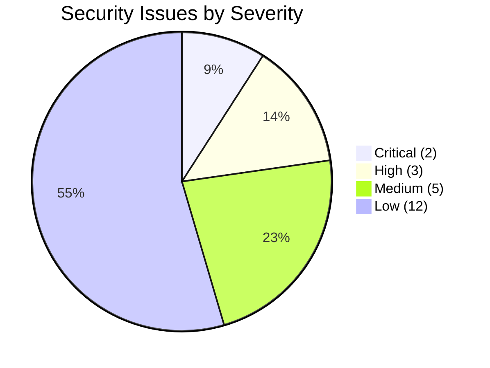

---

## 9️⃣ Database Query Execution Flow

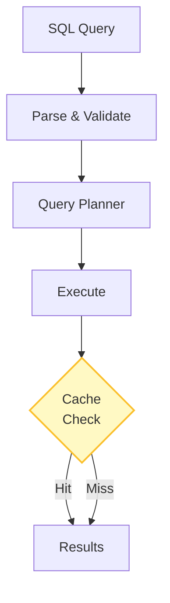

---

## 🔟 Service Health Status Matrix

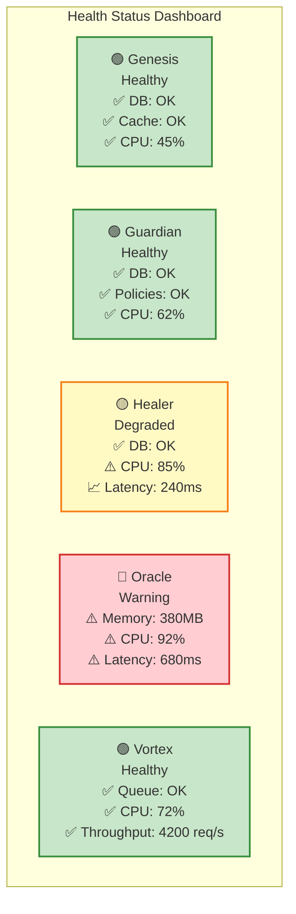

---

## 1️⃣1️⃣ Data Flow Architecture

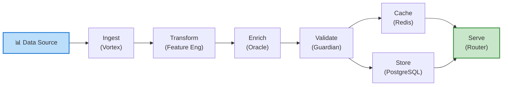

---

## 1️⃣2️⃣ Error Handling & Recovery Flow

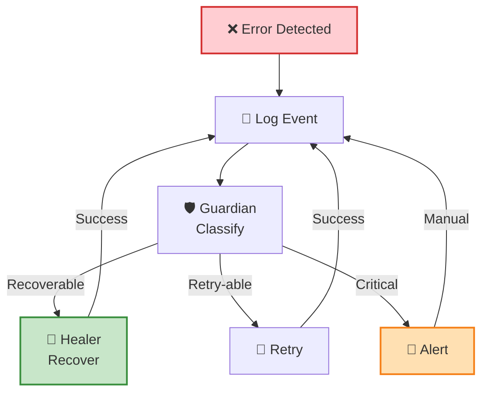

---

## 1️⃣3️⃣ Monitoring & Observability Stack

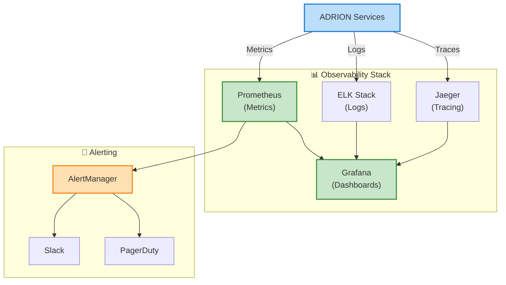

---

*Wizualizacje zaktualizowane: 14.05.2026*
