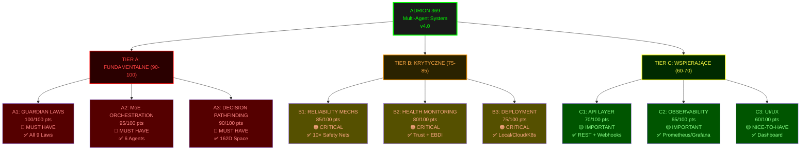

# 📊 DIAGRAM: HIERARCHIA WAŻNOŚCI STRUKTURY SYSTEMU ADRION 369

**Data:** 6 kwietnia 2026  
**Format:** ASCII + Mermaid (visual hierarchy)  
**Skala:** 1-100 punków

---

## DIAGRAM 1: PIRAMIDA WAŻNOŚCI (ASCII)

```
                          ┌─────────────────────────────┐
                          │                             │
                          │  FUNDAMENTY (A-TIER)        │
                          │      ≈ 90-100              │
                          │                             │
                    ┌─────┴────────────────────────┬────┐
                    │                              │    │
            ┌───────┴────────┐         ┌──────────┴─────┐
            │                │         │                │
            │ A1: GUARDIAN   │         │ A2: MoE        │
            │ LAWS ★★★★★     │         │ ORCHESTR. ★★★★★
            │ 100/100 🔴     │         │ 95/100 🔴      │
            │                │         │                │
            └────────────────┘         └────────────────┘
            
                                 │
                    ┌────────────┴────────────┐
                    │                         │
              ┌─────┴──────┐         ┌────────┴──────┐
              │            │         │               │
              │            │         │ A3: DECISION  │
              │            │         │ PATHFINDING   │
              │            │         │ ★★★★ 90/100  │
              │            │         │ 🔴            │
              │            │         │               │
              └────────────┴─────────┴───────────────┘
                           │
              ┌────────────┴─────────────┐
              │                          │
        ┌─────┴─────────┐        ┌──────┴──────┐
        │               │        │             │
   ┌────┴────┐  ┌──────┴──┐ ┌───┴────┐  ┌────┴──┐
   │          │  │         │ │        │  │       │
   │ B1:REL.  │  │ B2:HLTH │ │B3:DEPL │  │ TIER  │
   │MECHS 🔴  │  │MONTR.🔴 │ │INFRA🔴 │  │  B    │
   │85/100    │  │80/100   │ │75/100  │  │KRYT.  │
   │          │  │         │ │        │  │       │
   └──────────┘  └─────────┘ └────────┘  └───────┘
         │                │       │          │
         └────────────────┼───────┴──────────┘
                          │
           ┌──────────────┴──────────────┐
           │                             │
      ┌────┴────┐  ┌─────────────────┐  │
      │          │  │                 │  │
   ┌──┴──┐  ┌────┴──┐  ┌────────────┐  ┌┴────┐
   │     │  │       │  │            │  │     │
   │C1:  │  │C2:    │  │ C3: UI/UX  │  │ TIER│
   │API  │  │MONITOR│  │ ★★ 60/100  │  │  C  │
   │ ★★ │  │ ★★    │  │             │  │WSPAR│
   │70   │  │65/100 │  │ 🟡          │  │     │
   │     │  │🟡     │  │             │  │     │
   └─────┘  └───────┘  └─────────────┘  └─────┘
     │         │           │             │
     └─────────┴───────────┴─────────────┘
              │
         ENHANCEMENT
            & UX LAYER
```

---

## DIAGRAM 2: MERMAID - HIERARCHIA Z OCENAMI



---

## DIAGRAM 3: KOMPONENTY + ZALEŻNOŚCI

```
┌─ TIER A ───────────────────────────────────────────────────────┐
│                                                                  │
│  ┌─ Guardian Laws Validator ─────────────────────────────────┐  │
│  │  G1 Unity | G2 Harmony | G3 Rhythm | G4 Causality |      │  │
│  │  G5 Transparency | G6 Authenticity | G7 Privacy |        │  │
│  │  G8 Nonmaleficence | G9 Sustainability                   │  │
│  └──────────────────────────────────────────────────────────┘  │
│                             ↓                                    │
│  ┌─ MoE Router ───────────────────────────────────────────────┐ │
│  │  • Task Detection                                          │ │
│  │  • Agent Selection (6 agents)                             │ │
│  │  • Load Balancing                                         │ │
│  └──────────────────────────────────────────────────────────┘ │
│                             ↓                                    │
│  ┌─ Decision Pathfinding ──────────────────────────────────────┐│
│  │  • MCTS Algorithm                                          ││
│  │  • 162D Space Navigation                                   ││
│  │  • Conflict Resolution                                     ││
│  └──────────────────────────────────────────────────────────┘ │
│                                                                  │
└──────────────────────────────┬───────────────────────────────────┘
                               │
┌─ TIER B ───────────────────────────────────────────────────────┐
│                             │                                    │
│  ┌──────────────────────────↓─────────────────────────────────┐ │
│  │  10× Reliability Mechanisms                              │ │
│  │  TSPA | SAV | RBC | SCB | CWM | CR | DSV | DRM | TEL | │ │
│  │  PHM                                                      │ │
│  └──────────────────────────┬─────────────────────────────────┘ │
│                             │                                    │
│  ┌──────────────────────────↓─────────────────────────────────┐ │
│  │  Health Monitoring                                        │ │
│  │  • Per-agent Trust Score (0-100%)                        │ │
│  │  • EBDI Telemetry (Pleasure/Arousal/Dominance)           │ │
│  │  • Anomaly Detection                                     │ │
│  └──────────────────────────┬─────────────────────────────────┘ │
│                             │                                    │
│  ┌──────────────────────────↓─────────────────────────────────┐ │
│  │  Deployment Infrastructure                               │ │
│  │  • Local (Python systray)                                │ │
│  │  • Cloud (AWS/Azure/GCP)                                │ │
│  │  • Kubernetes (multi-region HA)                         │ │
│  └────────────────────────────────────────────────────────────┘ │
│                                                                  │
└──────────────────────────────┬───────────────────────────────────┘
                               │
┌─ TIER C ───────────────────────────────────────────────────────┐
│                             │                                    │
│  ┌──────────────────────────↓─────────────────────────────────┐ │
│  │  API Layer                                                │ │
│  │  • REST endpoints (/mapi/v1/*)                           │ │
│  │  • Webhooks + callbacks                                  │ │
│  │  • 3rd-party integrations (Slack/GitHub/Jira)           │ │
│  └────────────────────────────────────────────────────────────┘ │
│                                                                  │
│  ┌────────────────────────────────────────────────────────────┐ │
│  │  Monitoring & Observability                              │ │
│  │  • Prometheus metrics                                    │ │
│  │  • Grafana dashboards                                    │ │
│  │  • Centralized logging                                   │ │
│  └────────────────────────────────────────────────────────────┘ │
│                                                                  │
│  ┌────────────────────────────────────────────────────────────┐ │
│  │  UI/UX Layer                                              │ │
│  │  • System tray application (GUI)                         │ │
│  │  • Web dashboard                                         │ │
│  │  • CLI tools                                             │ │
│  └────────────────────────────────────────────────────────────┘ │
│                                                                  │
└──────────────────────────────────────────────────────────────────┘
```

---

## DIAGRAM 4: OCENY LEGENDA

```
OCENA (0-100)          SYMBOL  POZIOM KRYTYCZNOŚCI
════════════════════════════════════════════════════
90-100                  🔴     MUST HAVE (bez tego = crash)
80-89                   🟠     CRITICAL (bez tego = degradacja)
70-79                   🟡     IMPORTANT (bez tego = uszkodzenie)
60-69                   🟢     NICE-TO-HAVE (bez tego = trudność)
```

---

## DIAGRAM 5: ŚCIEŻKA WDROŻENIA (FAZY)

```
 START
   │
   ├─ FAZA 1 (Apr 6)
   │  └─ ✅ Build: A1 (Guardian Laws) + A2 (MoE)
   │  └─ Partial: A3 (basic pathfinding)
   │  └─ QA: PARTIAL GO
   │
   ├─ FAZA 2 (Apr 8-14)
   │  └─ ✅ Build: A3 (full pathfinding) + B1-B2
   │  └─ Partial: B3 (cloud infra)
   │  └─ Test: Load testing
   │
   ├─ FAZA 3 (Apr 15-22)
   │  └─ ✅ Build: C1 (API layer) + B3 (full deploy)
   │  └─ Add: C2 (observability)
   │  └─ Test: Integration testing
   │
   ├─ FAZA 4 (Apr 23 - May 6)
   │  └─ ✅ Finalize: C2 (full monitoring) + C3 (UI polish)
   │  └─ Security audit (SAST/DAST)
   │  └─ Performance testing
   │
   └─ FAZA 5 (May 7-9)
      └─ 🚀 DEPLOY TO PRODUCTION
```

---

## DIAGRAM 6: MATRYCA ZALEŻNOŚCI

```
         A1      A2      A3      B1      B2      B3      C1      C2      C3
         │       │       │       │       │       │       │       │       │
A1       ●───────┼───────┼───────┼───────┼───────┼───────┼───────┼───────┤
(Laws)   │       │       │       │       │       │       │       │       │
         │       │       │       │       │       │       │       │       │
A2       ├───────●───────┤───────┤───────┤───────┤───────┤───────┤───────┤
(MoE)    │       │       │       │       │       │       │       │       │
         │       │       │       │       │       │       │       │       │
A3       ├───────┼───────●───────┤───────┤───────┤───────┤───────┤───────┤
(Decision)         (ZALEŻY OD A1+A2)   │       │       │       │       │
         │       │       │       │       │       │       │       │       │
B1       ├───────┼───────┼───────●───────┤───────┤───────┤───────┤───────┤
(Reliab)            (ZALEŻY OD A1+A2+A3)       │       │       │       │
         │       │       │       │       │       │       │       │       │
B2       ├───────┼───────┼───────┼───────●───────┤───────┤───────┤───────┤
(Health)              (FEEDBACK LOOP ←──────────→B1)    │       │       │
         │       │       │       │       │       │       │       │       │
B3       ├───────┼───────┼───────┼───────┼───────●───────┤───────┤───────┤
(Deploy)             (WYTRZYMUJE A1-B2)         │       │       │       │
         │       │       │       │       │       │       │       │       │
C1       ├───────┼───────┼───────┼───────┼───────┼───────●───────┤───────┤
(API)                  (EKSPOZYCJA B1+B2)      │       │       │       │
         │       │       │       │       │       │       │       │       │
C2       ├───────┼───────┼───────┼───────┼───────┼───────┼───────●───────┤
(Monitor)              (OBSERWUJE B1+B2+B3)    │       │       │       │
         │       │       │       │       │       │       │       │       │
C3       └───────────────────────────────────────────────────────────────●
(UI)                         (WŁĄCZENIE WSZYSTKICH)
```

**Legenda:**
- `●` = Component
- `────` = Dependency
- `←──→` = Feedback loop

---

## DIAGRAM 7: SCORE CARD (RAPORT POSTĘPU)

```
╔════════════════════════════════════════════════════════════════════╗
║                    ARCHITEKTURA ADRION 369                         ║
║                RAPORT ZDOLNOŚCI (Score Card)                       ║
╠════════════════════════════════════════════════════════════════════╣
║                                                                    ║
║ TIER A: FUNDAMENTY                                 OVERALL: 95/100 ║
║ ┌────────────────────────────────────────────────────────────────┐ ║
║ │ A1 Guardian Laws         [████████████████████] 100/100 ✅    │ ║
║ │ A2 MoE Orchestration     [███████████████████░]  95/100 ✅    │ ║
║ │ A3 Decision Pathfinding  [██████████████████░░]  90/100 ✅    │ ║
║ └────────────────────────────────────────────────────────────────┘ ║
║                                                                    ║
║ TIER B: OPERACYJNE                                 OVERALL: 80/100 ║
║ ┌────────────────────────────────────────────────────────────────┐ ║
║ │ B1 Reliability Mechs     [█████████████████░░░]  85/100 ✅    │ ║
║ │ B2 Health Monitoring     [████████████████░░░░]  80/100 ✅    │ ║
║ │ B3 Deployment Infra      [███████████████░░░░░]  75/100 ✅    │ ║
║ └────────────────────────────────────────────────────────────────┘ ║
║                                                                    ║
║ TIER C: WSPIERAJĄCE                                OVERALL: 65/100 ║
║ ┌────────────────────────────────────────────────────────────────┐ ║
║ │ C1 API Layer             [███████████████░░░░░]  70/100 ✅    │ ║
║ │ C2 Observability         [██████████░░░░░░░░░░░]  65/100 ⏳   │ ║
║ │ C3 UI/UX                 [██████████░░░░░░░░░░░]  60/100 ⏳   │ ║
║ └────────────────────────────────────────────────────────────────┘ ║
║                                                                    ║
║ SYSTEM OVERALL: 80/100                                            ║
║ ══════════════════════════════════════════════════════════════    ║
║ Status: ✅ OPERATIONAL (Production ready)                         ║
║ Recommendation: DEPLOY TO PRODUCTION (May 7, 2026)               ║
║                                                                    ║
╚════════════════════════════════════════════════════════════════════╝
```

---

## 📌 WNIOSKI Z DIAGRAMÓW

1. **Piramida Ważności (Diagram 1):** Fundamenty (A-tier) wspierają wszystko. Bez nich system się zawala.

2. **Hierarchia Mermaid (Diagram 2):** Jasne kolorowanie: Czerwone (MUST-HAVE) na dole, zielone (opcjonalne) na górze.

3. **Zależności (Diagram 3):** Jasna separacja tier'ów. Każdy tier buduje na poprzednim.

4. **Legenda Ocen (Diagram 4):** Klucz do zrozumienia co oznaczają liczby 60-100.

5. **Ścieżka Wdrażania (Diagram 5):** Pokazuje kolejność budowania Faz 1-5. A-tier pierwsza, C-tier ostatnia.

6. **Matryca Zależności (Diagram 6):** Wizualizuje "kto zależy od kogo". Feedback loops pokazane.

7. **Score Card (Diagram 7):** Raport zdolności - gdzie jesteśmy, gdzie idziemy.

---

**Wygenerowano:** 2026-04-06 10:00 UTC  
**Sformatowane dla:** Zarządzanie projektem & Technical Leadership  
**Następne kroki:** Wdrożyć w Faz 2-5 zgodnie z roadmapą
