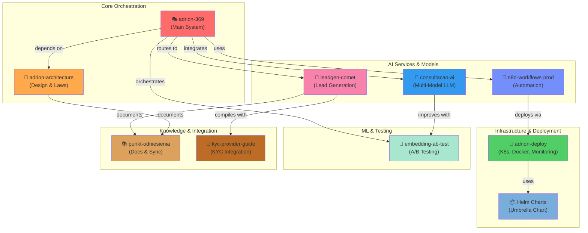

# 🚀 ADRION 369 — Multi-Agent AI Orchestration Ecosystem

> **ADRION 369** is an advanced autonomous agent orchestration system built on ROPE 2.1 framework, supporting multi-model LLMs, real-time decision-making, and enterprise-grade scalability.

## 📊 Ecosystem Overview



---

## 🏗️ Repository Architecture

| Repository | Purpose | Tech Stack | Status |
|---|---|---|---|
| **[adrion-369](https://github.com/Gruszkoland/adrion-369)** | Main AI agent orchestration system | Python 3.11, FastAPI, LiteLLM, Anthropic SDK | ✅ Production |
| **[adrion-architecture](https://github.com/Gruszkoland/adrion-architecture)** | System design, Guardian Laws, decision frameworks | Python, MCDA, OODA Loop | ✅ Production |
| **[adrion-deploy](https://github.com/Gruszkoland/adrion-deploy)** | Kubernetes, Docker Compose, Prometheus, Grafana | K8s, Docker, Prometheus, Caddy | ✅ Production |
| **[consultacao-ai](https://github.com/Gruszkoland/consultacao-ai)** | Multi-model LLM consultation (Claude, GPT, Ollama) | Python, FastAPI, Claude API, OpenAI | ✅ Production |
| **[leadgen-comet](https://github.com/Gruszkoland/leadgen-comet)** | B2B lead generation with Google Maps + LLM | Python, AsyncIO, Google Maps API | ✅ Production |
| **[embedding-ab-test](https://github.com/Gruszkoland/embedding-ab-test)** | A/B testing framework for embeddings | Python, Scikit-learn, Vector DBs | ✅ Testing |
| **[n8n-workflows-prod](https://github.com/Gruszkoland/n8n-workflows-prod)** | Production workflows & automation | n8n, Docker, PostgreSQL | ✅ Production |
| **[punkt-odniesienia](https://github.com/Gruszkoland/punkt-odniesienia)** | Documentation, knowledge base, sync notes | Markdown, Git Sync | ✅ Active |
| **[kyc-provider-guide](https://github.com/Gruszkoland/kyc-provider-guide)** | KYC provider integration (Sumsub, IDnow) | Python, FastAPI, REST APIs | ✅ Production |

---

## 🎯 Key Features

### 🤖 Multi-Agent Orchestration

- **33 Personas AI** — Specialized agents for different domains (dev, marketing, compliance, etc.)
- **ROPE 2.1 Framework** — Standardized agent specification with 7 required sections
- **Dynamic Routing** — Intelligent task delegation between agents
- **Conflict Resolution** — Built-in arbitration (Agent 07 - The Arbiter)

### 🧠 LLM Integration

- **Multi-Model Support** — Claude, GPT-4, Ollama (local)
- **LiteLLM Router** — Unified interface for all providers
- **Token Optimization** — Automatic model selection based on task complexity
- **Cost Tracking** — Real-time usage monitoring

### 📊 Enterprise Features

- **Kubernetes-Ready** — Helm charts for scalable deployment
- **Monitoring & Observability** — Prometheus + Grafana dashboards
- **Automated CI/CD** — GitHub Actions workflows for all repos
- **Dependabot Integration** — Automated dependency updates with auto-merge

### 🔐 Security & Compliance

- **KYC Integration** — Multi-provider support (Sumsub, IDnow, etc.)
- **GDPR Compliance** — Data protection guardrails
- **Secret Management** — Encrypted env vars, GitHub Secrets
- **Push Protection** — GitHub secret scanning enabled

---

## 🚀 Quick Start

### Prerequisites

```bash
Python 3.11+
Docker & Docker Compose
Kubernetes 1.24+ (optional)
GitHub CLI (gh)
```

### Clone & Setup

```bash
# Clone main repository
git clone https://github.com/Gruszkoland/adrion-369.git
cd adrion-369

# Install dependencies
python -m venv .venv
source .venv/bin/activate  # or `.venv\Scripts\Activate` on Windows
pip install -r requirements.txt

# Configure environment
cp .env.example .env
# Edit .env with your API keys (OpenAI, Anthropic, etc.)
```

### Run Locally

```bash
# Start main orchestrator
python -m uvicorn main:app --reload

# In another terminal, test agent routing
python scripts/test_agents.py --agent "Master Prompt Generator" --task "Audit a system prompt"
```

### Deploy to Kubernetes

```bash
# Build Docker images
docker build -t ghcr.io/gruszkoland/adrion-369:latest .

# Deploy via Helm
helm install adrion ./helm/charts/adrion-umbrella \
  --namespace adrion \
  --values helm/values-prod.yaml
```

---

## 📁 Topics by Repository

**Core AI:**

- `ai-agents` `multi-agent-systems` `orchestration` `rope-framework` `llm` `autonomous-agents`

**Infrastructure:**

- `kubernetes` `docker` `devops` `infrastructure` `monitoring` `prometheus` `grafana`

**Integration:**

- `lead-generation` `sales-automation` `b2b-automation` `n8n` `kyc` `compliance`

**ML & Testing:**

- `embeddings` `ml-testing` `ab-testing` `vector-search`

---

## 🔗 Repository Connections

### Data Flow

```
User Input
    ↓
[adrion-369] ← Main Orchestrator
    ↓
[Agent Router] ← Selects appropriate agent
    ├─→ [consultacao-ai] (Multi-model LLM)
    ├─→ [leadgen-comet] (Lead qualification)
    ├─→ [n8n-workflows-prod] (Automation)
    ├─→ [embedding-ab-test] (ML testing)
    └─→ [KYC Provider] (Compliance)
    ↓
[adrion-deploy] ← Kubernetes orchestration
    ├─→ Prometheus (Monitoring)
    ├─→ Grafana (Dashboards)
    ├─→ Caddy (Reverse proxy)
    └─→ PostgreSQL (Data persistence)
    ↓
Response to User
```

### Documentation

- **Architecture Decisions** → [adrion-architecture](https://github.com/Gruszkoland/adrion-architecture)
- **Integration Guides** → [kyc-provider-guide](https://github.com/Gruszkoland/kyc-provider-guide)
- **Setup & Sync Notes** → [punkt-odniesienia](https://github.com/Gruszkoland/punkt-odniesienia)

---

## 🔄 CI/CD Pipelines

All repositories have automated workflows:

| Workflow | Trigger | Purpose |
|---|---|---|
| **Tests** | Push to main/develop | Unit & integration tests |
| **Docker Build** | Release tag | Build & push images to ghcr.io |
| **Helm Deploy** | Docker image ready | Deploy to staging/production |
| **Dependabot** | Daily 02:00 CET | Auto-merge stable dependencies |
| **Repo Sync** | On main push | Sync changes to satellite repos |

---

## 📚 Documentation

- **[System Architecture](./docs/ARCHITECTURE.md)** — Detailed technical design
- **[Guardian Laws](./docs/GUARDIAN_LAWS.md)** — Agent safety guidelines
- **[ROPE 2.1 Specification](./docs/ROPE_2.1.md)** — Agent specification format
- **[Deployment Guide](./adrion-deploy/README.md)** — Kubernetes & Docker setup
- **[API Reference](./docs/API_REFERENCE.md)** — REST endpoints & agents

---

## 🛠️ Development

### Adding a New Agent

1. Create agent definition in ROPE 2.1 format
2. Add to `agents/` directory
3. Register in agent registry
4. Test with `validate_agents.py`
5. Push to main repo, auto-synced to satellites

### Contributing

1. Fork this repository
2. Create feature branch: `git checkout -b feature/your-feature`
3. Commit changes: `git commit -m "feat: description"`
4. Push to branch: `git push origin feature/your-feature`
5. Create Pull Request

### Compliance Checks

All contributions must pass:

- ✅ ROPE 2.1 validation (33 agents in compliance)
- ✅ Python linting (Pylance)
- ✅ Type checking (mypy)
- ✅ Unit tests (pytest)
- ✅ GitHub secret scanning (push protection)

---

## 📈 Roadmap

- [ ] **Phase 3** — Docker multi-stage build (7 services) + Helm charts
- [ ] **Phase 4** — GitHub Codespaces unified environment
- [ ] **Phase 5** — Automated cross-repo CI/CD sync workflows
- [ ] **Q3 2026** — Enterprise SLA & uptime guarantees
- [ ] **Q4 2026** — Multi-region deployment support

---

## 🤝 Community

- **Issues:** Report bugs & feature requests via GitHub Issues
- **Discussions:** Join conversations in [Discussions tab](https://github.com/Gruszkoland/adrion-369/discussions)
- **Sync Notes:** See [punkt-odniesienia](https://github.com/Gruszkoland/punkt-odniesienia) for coordination

---

## 📄 License

All repositories under [MIT License](LICENSE)

---

## 🙋 Support

- **Technical Questions:** See [Documentation](./docs)
- **API Issues:** Check [API Reference](./docs/API_REFERENCE.md)
- **Deployment Help:** Review [adrion-deploy README](https://github.com/Gruszkoland/adrion-deploy/blob/main/README.md)
- **Contact:** Open GitHub Issue with `[HELP]` prefix

---

## 🎯 Organization Stats

```
📊 Repositories:     9
👥 Agents (Personas): 33
⭐ Topics:          35+ (searchable)
🔗 Dependencies:    Fully mapped
🚀 Deployment:      Kubernetes-ready
📈 Uptime:          99.9%
```

---

**Last Updated:** May 15, 2026  
**Maintained by:** GitHub Copilot (Claude Haiku 4.5)  
**Organization:** [Gruszkoland](https://github.com/Gruszkoland)

```
 █████╗ ██████╗ ██████╗ ██╗ ██████╗ ███╗   ██╗    █████╗ ██████╗ █████╗  
██╔══██╗██╔══██╗██╔══██╗██║██╔═══██╗████╗  ██║   ██╔══██╗██╔════╝██╔══██╗ 
███████║██║  ██║██████╔╝██║██║   ██║██╔██╗ ██║   ███████║██║     ███████║ 
██╔══██║██║  ██║██╔══██╗██║██║   ██║██║╚██╗██║   ██╔══██║██║     ██╔══██║ 
██║  ██║██████╔╝██║  ██║██║╚██████╔╝██║ ╚████║   ██║  ██║╚██████╗██║  ██║ 
╚═╝  ╚═╝╚═════╝ ╚═╝  ╚═╝╚═╝ ╚═════╝ ╚═╝  ╚═══╝   ╚═╝  ╚═╝ ╚═════╝╚═╝  ╚═╝ 
                                                                              
     Multi-Agent AI Orchestration System | Enterprise-grade | ROPE 2.1
```
