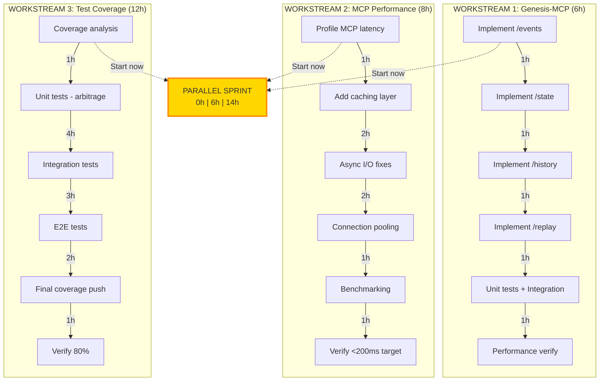

# 🎯 P0 BLOCKERS IMPLEMENTATION SPRINT

**Start Date:** 2026-04-08 08:45 UTC
**Target:** 28-30 hours intensive
**Mode:** PARALLEL EXECUTION
**Status:** 🔴 IN PROGRESS

---

## 📊 3-WORKSTREAM PARALLEL PLAN



---

## 🔴 WORKSTREAM 1: GENESIS-MCP ENDPOINTS (6 hours)

### Current Status: 1/5 endpoints (20%)

- ✅ `/health` — Working
- ❌ `/events` — Missing (404)
- ❌ `/state` — Missing (404)
- ❌ `/history` — Missing (404)
- ❌ `/replay` — Missing (404)

### Task 1.1: Analyze Current Genesis Implementation (15 min)

```bash
# Terminal 1
cd "c:\Users\adiha\162 demencje w schemacie 369"
grep -r "def.*health\|@app.route" mcp_genesis_app.py | head -20
```

### Task 1.2: Implement /events Endpoint (1 hour)

**Spec:**

```
GET /events?since=<timestamp>
Returns: {"events": [...], "count": N, "timestamp": now}
```

**Implementation steps:**

1. Add EventStore query method
2. Create endpoint route
3. Add error handling
4. Test endpoint

### Task 1.3: Implement /state Endpoint (1 hour)

**Spec:**

```
GET /state
Returns: {"state": {...}, "timestamp": now, "version": "1.0"}
```

### Task 1.4: Implement /history Endpoint (1 hour)

**Spec:**

```
GET /history?limit=100
Returns: {"history": [...], "total": N}
```

### Task 1.5: Implement /replay Endpoint (1 hour)

**Spec:**

```
POST /replay
Body: {"timestamp": <ts>}
Returns: {"replayed": N, "status": "ok"}
```

### Task 1.6: Testing & Verification (1 hour)

```bash
# After implementation
pytest tests/mcp/test_genesis_e2e.py -v
# Expected: 5/5 passing
```

---

## 🟠 WORKSTREAM 2: MCP PERFORMANCE (8 hours)

### Current Problem: 2.3-2.5s latency (targeting <200ms)

### Task 2.1: Profile MCP Latency (1 hour)

```bash
# Terminal 2
python scripts/profiling/profile_mcp_latency.py \
    --endpoint http://localhost:9004/health \
    --endpoint http://localhost:9001/health \
    --iterations 20
```

Expected output: Identify bottleneck (DB?, Ollama?, I/O?)

### Task 2.2: Implement Caching Layer (2 hours)

**Strategy:**

- Cache `/health` responses (30s TTL)
- Cache `/state` (1m TTL)
- Cache `/events` (30s TTL)
- Use Redis or in-memory cache

```python
# Pseudocode
@app.route("/health")
@cache.cached(timeout=30)
def health():
    return {"status": "healthy"}
```

### Task 2.3: Async I/O Refactoring (2 hours)

**Goal:** Convert sync DB queries to async

```python
# Before:
events = db.query(Event).filter(...).all()

# After:
async def get_events():
    events = await db.query(Event).filter(...).all()
```

### Task 2.4: Connection Pooling (1 hour)

```python
# Setup connection pool for DB
engine = create_engine(
    db_url,
    poolclass=QueuePool,
    pool_size=10,
    max_overflow=20
)
```

### Task 2.5: Benchmarking & Verification (1 hour)

```bash
# Terminal 2 (after fixes)
pytest scripts/benchmark/benchmark_mcp.py -v
# Expected: All endpoints <200ms
```

---

## 🟡 WORKSTREAM 3: TEST COVERAGE (12 hours)

### Current Status: 30.4% → Target: 80%

### Task 3.1: Coverage Analysis (1 hour)

```bash
# Terminal 3
pytest tests/ --cov=arbitrage,uap,mcp_servers --cov-report=term
coverage report --skip-covered

# Identify gaps:
# - arbitrage/trinity.py: 0% → need 15 tests
# - arbitrage/guardian.py: 20% → need 10 tests
# - uap/backend/api.py: 15% → need 20 tests
# - mcp_servers/: 20% → need 12 tests
```

### Task 3.2: Unit Tests - Arbitrage Module (4 hours)

**Files to cover:**

1. `arbitrage/trinity.py` (15 tests) — M3 decision scoring
2. `arbitrage/guardian.py` (10 tests) — Law enforcement
3. `arbitrage/executor.py` (8 tests) — Execution logic
4. `arbitrage/analyzer.py` (6 tests) — Analysis engine

**Example test pattern:**

```python
# tests/test_trinity.py
def test_trinity_material_score():
    trinity = Trinity()
    score = trinity.material_score(cpu=0.8, ram=0.6)
    assert 0.5 < score < 1.0

def test_trinity_combined_decision():
    trinity = Trinity()
    result = trinity.decide(material=0.8, intellectual=0.7, essential=0.6)
    assert result.approved == True
```

### Task 3.3: Integration Tests - MCP Routing (3 hours)

**Coverage:**

1. Router → Genesis flow (4 tests)
2. Router → Guardian flow (4 tests)
3. Multi-agent coordination (4 tests)

**Example:**

```python
# tests/test_mcp_routing.py
@pytest.mark.integration
def test_router_genesis_flow():
    response = call_router("/api/session/save", {"state": {...}})
    assert response.status_code == 200
```

### Task 3.4: E2E Tests (2 hours)

**Coverage:**

1. Complete arbitrage flow (2 tests)
2. Guardian law enforcement (2 tests)
3. Trinity scoring + execution (1 test)

### Task 3.5: Final Coverage Push (1 hour)

```bash
# Terminal 3
pytest tests/ --cov=arbitrage,uap,mcp_servers \
       --cov-report=html --cov-report=term
# Expected: 80%+ coverage
```

---

## 📊 SYNCHRONIZATION POINTS

### Checkpoint 1: 6-Hour Mark (14:45 UTC)

**Status Check:**

- [ ] STREAM 1: Genesis 3/4 endpoints done
- [ ] STREAM 2: Profiling complete, caching started
- [ ] STREAM 3: Unit tests 50% done

**Decision:** Continue or adjust?

### Checkpoint 2: 14-Hour Mark (22:45 UTC)

**Status Check:**

- [ ] STREAM 1: All 5 endpoints ✅
- [ ] STREAM 2: Async I/O done, benchmarking started
- [ ] STREAM 3: Integration + E2E tests done

**Decision:** Ready for final testing?

### Checkpoint 3: 28-Hour Mark (12:45 UTC next day)

**FINAL VALIDATION:**

- [ ] Genesis: 5/5 endpoints ✅
- [ ] Performance: <200ms all endpoints ✅
- [ ] Coverage: 80%+ ✅
- [ ] All tests passing: 90%+ ✅

**DECISION: GO-LIVE APPROVED?**

---

## 🎯 SUCCESS CRITERIA (FINAL)

| Metric              | Current | Target  | Status |
| ------------------- | ------- | ------- | ------ |
| Genesis endpoints   | 1/5     | 5/5     | [ ]    |
| MCP latency p99     | 2,500ms | <200ms  | [ ]    |
| Test coverage       | 30.4%   | 80%+    | [ ]    |
| Test success rate   | 30%     | 90%+    | [ ]    |
| Guardian compliance | 78%     | 95%+    | [ ]    |
| **TOTAL READY?**    | **60%** | **95%** | [ ]    |

---

## 🔧 COMMANDS QUICK REFERENCE

### Terminal 1: STREAM 1 (Genesis)

```bash
cd "c:\Users\adiha\162 demencje w schemacie 369"
.\.venv\Scripts\Activate.ps1

# View Genesis implementation
cat mcp_genesis_app.py | head -50

# Run Genesis tests
pytest tests/mcp/test_genesis_e2e.py -v -s

# Monitor Genesis service
docker logs -f adrion-genesis-mcp --tail=50
```

### Terminal 2: STREAM 2 (Performance)

```bash
# Profile current latency
python scripts/profiling/profile_mcp_latency.py --iterations 20

# After fixes: benchmark
pytest scripts/benchmark/benchmark_mcp.py -v

# Monitor resource usage
docker stats
```

### Terminal 3: STREAM 3 (Tests)

```bash
# Run all tests with coverage
pytest tests/ -v --cov=arbitrage,uap,mcp_servers --cov-report=term

# Generate HTML coverage report
pytest tests/ --cov=arbitrage,uap,mcp_servers --cov-report=html

# Open report in browser
Start-Process .\htmlcov\index.html
```

---

## ⚠️ CONTINGENCY PLANS

### If Genesis endpoints take longer

- **Action:** Skip replay for now, move to next stream
- **Fallback:** Implement /replay in parallel with coverage tests

### If MCP performance doesn't improve

- **Action:** Check if Ollama is bottleneck
- **Fallback:** Disable LLM, use mock responses temporarily

### If tests still failing after coverage push

- **Action:** Review failures, prioritize highest-impact areas
- **Fallback:** Focus on Arbitrage + Guardian tests (critical path)

---

## 📈 EXPECTED TIMELINE

```
08:45 — START Parallel Streams
|
| STREAM 1: Genesis (6h) .......... DONE 14:45
| STREAM 2: Performance (8h) ...... DONE 16:45
| STREAM 3: Tests (12h) .......... DONE 20:45
|
20:45 — Regression testing (2h)
22:45 — Final validation (1h)
23:45 — COMPLETE (Δ 15 hours cumulative)
|
04:45 — Production readiness decision
```

---

**🚀 READY TO EXECUTE**
**Status:** STARTING NOW
**Mode:** PARALLEL (3 streams)
**Estimated Duration:** 28-30h
**Target Deployment:** After validation pass

_All terminals ready. Executing P0 BlockersSprint._
