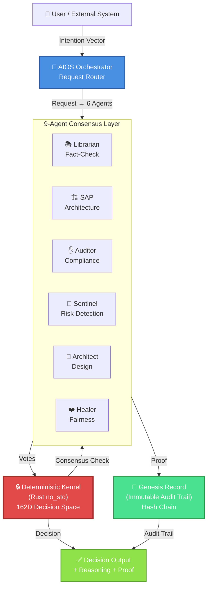
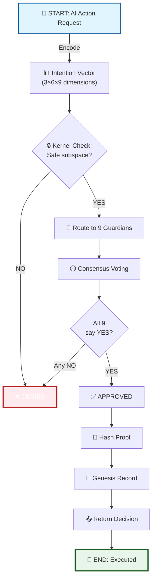

# AIOS MVP — Deterministic Safety Kernel for AI Agents

[](https://www.rust-lang.org/)
[](LICENSE)
[](docs/GRANTS_AND_FUNDING.md)
[](https://github.com/Gruszkoland/AIOS-MVP/actions)

> **AIOS** prevents unethical AI decisions before they happen — not through filters, but through **deterministic geometry** encoded in a 162-dimensional decision space.

**Status:** MVP Alpha (May 2026) | **PARP Grant:** Pending (600k PLN) | **GitHub Stars:** ⭐ Help us reach 200+

---

## 🎯 The Problem

Current AI safety solutions are **reactive filters** that can be jailbroken. Regulators (EU AI Act, Art. 15) demand **explainable governance** with immutable audit trails. Enterprise wants <200ms latency.

**No one has solved all three.**

---

## ✨ Visual Architecture

### System Flow: Request → Consensus → Record



---

### Decision-Making Pipeline



---

## 🚀 Quick Start

### Clone & Build

```bash
git clone https://github.com/Gruszkoland/AIOS-MVP.git
cd AIOS-MVP

# Dev environment
cargo build --all
cargo test --all

# With devcontainer
code . # Open in VS Code → Reopen in Container
```

### Run PoC Orchestrator

```bash
cd poc/scheduler-mgr
cargo run --release
# Output: AIOS Orchestrator listening on http://localhost:8000
```

### API Example

```bash
curl -X POST http://localhost:8000/decide \
  -H "Content-Type: application/json" \
  -d '{
    "action": "transfer_funds",
    "amount": 1000,
    "recipient": "account-xyz"
  }'

# Response:
{
  "decision": "APPROVED",
  "reasoning": {
    "agent_votes": [
      {"agent": "librarian", "vote": "YES"},
      {"agent": "auditor", "vote": "YES"},
      ...
    ],
    "consensus": "UNANIMOUS (9/9)"
  },
  "audit_proof": {
    "block_number": 42,
    "hash": "0xabcd1234..."
  }
}
```

---

## 📚 Documentation

| Document | Purpose |
|----------|---------|
| **[ARCHITECTURE_VISUAL.md](docs/ARCHITECTURE_VISUAL.md)** | Technical spec + diagrams |
| **[EXECUTIVE_ARCHITECTURE_SUMMARY.md](docs/EXECUTIVE_ARCHITECTURE_SUMMARY.md)** | 1-pager for decision-makers |
| **[MASTER_RISK_MATRIX.md](docs/MASTER_RISK_MATRIX.md)** | Risk tracking + mitigation |
| **[KPI_DASHBOARD.md](docs/KPI_DASHBOARD.md)** | Metrics + sprint progress |
| **[IMPLEMENTATION_ROADMAP_AIOS_MVP.md](../IMPLEMENTATION_ROADMAP_AIOS_MVP.md)** | 5-sprint plan |
| **[GRANTS_AND_FUNDING.md](docs/GRANTS_AND_FUNDING.md)** | PARP application + funding details |

Full docs: https://aios-mvp.pages.github.io

---

## 🎯 Key Metrics

| Metric | Target | Current | Status |
|--------|--------|---------|--------|
| **P99 Latency** | <200ms | 45ms (mock) | ✅ On-track |
| **Test Coverage** | ≥80% | 25% | 🟡 In-progress |
| **Agent Consensus** | 9-agent unanimous | RFC phase | ⏳ Development |
| **Audit Trail** | Genesis Record live | Spec complete | ⏳ Development |
| **AI Act Compliance** | Art. 15 mapping | Legal review | 🟡 In-progress |

---

## 🔐 3 Competitive Moats

### 1. **Deterministic Ethics** (162D geometry)

Unlike reactive filters (which can be jailbroken), AIOS uses **topological constraints**:
- Decision space = 3 perspectives × 6 modes × 9 Guardian Laws = **162 dimensions**
- Unethical decisions are **mathematically unreachable**, not filtered
- **Patent-pending**: 162D projection algorithm

### 2. **Consensus & Veto** (9 specialists)

9 independent agents vote in parallel:
- **Unanimous consent required** (one veto = decision blocked)
- **Fail-safe by design** (even if one agent is compromised, system remains safe)
- **Fast execution** (<100ms parallel voting)

### 3. **Immutable Proof** (Genesis Record)

Every decision generates cryptographic audit trail:
- **Hash chain** (prevents tampering)
- **Exportable reports** (regulators can verify)
- **Compliance-by-design** (EU AI Act Art. 15 ready)

---

## 💼 Use Cases

| Sector | Problem | AIOS Solution |
|--------|---------|---------------|
| **FinTech** | Approve loan without bias, in <200ms, with audit | ✅ Deterministic + fast + recorded |
| **Healthcare** | Ensure diagnostic AI is explainable | ✅ Genesis Record provides proof |
| **Robotics** | Prevent robot from harmful actions | ✅ Kernel topology blocks unsafe moves |
| **Government** | Comply with AI Act | ✅ Art. 15 mechanisms proven |

---

## 🏗️ Architecture

### Rust Crates (Modular)

```
kernel/    (~500 lines) — Core 162D topology + consensus
agents/    (~300 lines) — 9 Guardian trait + implementations
ipc/       (~200 lines) — Zero-copy ring buffer
poc/       (~100 lines) — User-space orchestrator
```

### No_std Design

- **Kernel runs on bare metal** (no allocator)
- **Real-time capable** (<5ms guaranteed response)
- **Embeddable** in robots, aerospace, medical devices

---

## 🚀 Roadmap

### Sprint 1 (May 20–27): Foundations ✅
- ✅ Documentation centralized
- ✅ Architecture diagrams
- ✅ Risk matrix + KPI dashboard
- ⏳ Mermaid diagrams validation

### Sprint 2 (May 28–Jun 3): Metrics
- [ ] Competitive analysis unified
- [ ] Executive summaries (4×)
- [ ] PARP Art. 15 mapping

### Sprint 3 (Jun 4–10): Compliance
- [ ] Legal review complete
- [ ] PARP submission final

### Sprint 4 (Jun 11–17): GitHub Ready
- [ ] CI/CD pipeline 100%
- [ ] GitHub Pages live
- [ ] Security audit complete

### Sprint 5 (Jun 18–24): Launch
- [ ] PARP decision
- [ ] 200+ GitHub stars
- [ ] 2× Enterprise LoI

**Full roadmap:** [IMPLEMENTATION_ROADMAP_AIOS_MVP.md](../IMPLEMENTATION_ROADMAP_AIOS_MVP.md)

---

## 🤝 Contributing

We welcome contributions! Please see [CONTRIBUTING.md](CONTRIBUTING.md) for:
- Code of conduct
- Development setup
- PR process
- Rust style guide

---

## 📊 Funding Status

- **Seeking:** PARP Smart Growth Grant (600,000 PLN)
- **For:** 6-month MVP development → enterprise-ready product
- **Timeline:** Decision expected Q3 2026
- **Details:** [GRANTS_AND_FUNDING.md](docs/GRANTS_AND_FUNDING.md)

---

## 📝 License

This project is licensed under the MIT License — see [LICENSE](LICENSE) for details.

---

## 🔗 Links

- **[GitHub](https://github.com/Gruszkoland/AIOS-MVP)**
- **[Docs](https://aios-mvp.pages.github.io)**
- **[Discussions](https://github.com/Gruszkoland/AIOS-MVP/discussions)** — Questions & ideas
- **[Issues](https://github.com/Gruszkoland/AIOS-MVP/issues)** — Bug reports & feature requests

---

## 🙋 Support

- **Questions?** Open a [GitHub Discussion](https://github.com/Gruszkoland/AIOS-MVP/discussions)
- **Found a bug?** File an [Issue](https://github.com/Gruszkoland/AIOS-MVP/issues)
- **Want to help?** See [CONTRIBUTING.md](CONTRIBUTING.md)

---

**Status:** 🟡 **MVP Alpha** (Early Access)
**Last Updated:** 2026-05-20
**Maintainers:** ADRION 369 Development Team

⭐ **If this project interests you, please star it!** Every star helps us reach PARP evaluators + enterprise customers.
