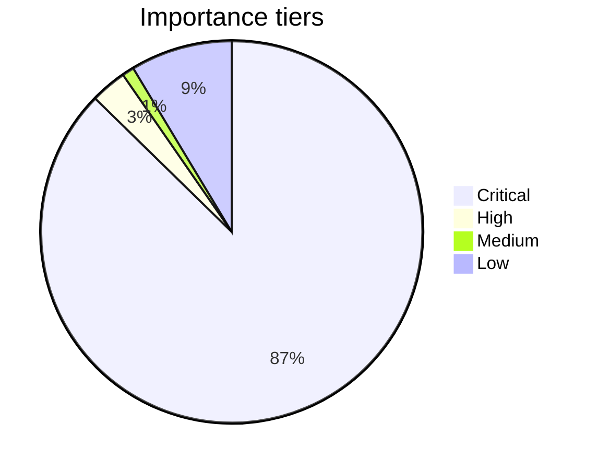

# Importance Index

Data wygenerowania: 2026-05-09 07:03:54
Cel: oddzielic dokumenty krytyczne od wspierajacych i archiwalnych.

## Scoring model

- Krytycznosc pochodzi z nazw, sciezek, liczby linkow, wielkosci i swiezosci.
- Huby, indeksy, architecture, security i 162D dostaja najwyzszy priorytet.

## Tier summary

| Tier | Dokumenty |
|---|---:|
| Critical | 172 |
| High | 6 |
| Medium | 2 |
| Low | 17 |

### Critical (172)

| Dokument | Temat | Score | Sygnały |
|---|---|---:|---|
| [WORKSPACE_STRUCTURE_SCAN_2026-04-08](sessions/WORKSPACE_STRUCTURE_SCAN_2026-04-08.md) | AI i orkiestracja agentów | 87.50 | readme:1; hub:2; dashboard:4; architecture:2; security:6; threat:1; production:3; deploy:16 |
| [INDEX_QUICK_NAVIGATION](sessions/INDEX_QUICK_NAVIGATION.md) | AI i orkiestracja agentów | 80.08 | readme:1; index:3; hub:3; architecture:4; security:5; production:1; deploy:9; runbook:2 |
| [DEPLOYMENT_SUMMARY](guides/DEPLOYMENT_SUMMARY.md) | Wdrożenia i operacje | 73.50 | readme:1; index:4; dashboard:9; architecture:2; security:3; production:3; deploy:10; workflow:1 |
| [SKILLS_INSTALLATION_REPORT_Apr10_2026](sessions/SKILLS_INSTALLATION_REPORT_Apr10_2026.md) | AI i orkiestracja agentów | 69.75 | index:7; hub:4; dashboard:1; architecture:1; security:3; deploy:2; workflow:4; guide:1 |
| [ORACLE_CLOUD_READY](ORACLE_CLOUD_READY.md) | Wdrożenia i operacje | 66.25 | hub:2; dashboard:5; architecture:5; security:9; production:5; deploy:34; quickstart:2; guide:9 |
| [GETTING_STARTED](guides/GETTING_STARTED.md) | Dane, kopie i odtwarzanie | 64.25 | readme:2; index:1; dashboard:7; architecture:3; security:1; production:6; deploy:1; workflow:2 |
| [COMPLETE_DOCKER_DEPLOYMENT_GUIDE](guides/COMPLETE_DOCKER_DEPLOYMENT_GUIDE.md) | Monitorowanie i obserwowalność | 63.50 | dashboard:8; security:1; production:3; deploy:4; workflow:5; guide:3; 162d:2; guardian:1 |
| [SESSION_COMPLETION_REPORT_2026-04-08](sessions/SESSION_COMPLETION_REPORT_2026-04-08.md) | Bezpieczeństwo i zgodność | 63.25 | readme:1; index:2; architecture:2; security:19; production:4; deploy:13; workflow:1; guide:11 |
| [STARTING_HERE](guides/STARTING_HERE.md) | Wdrożenia i operacje | 63.00 | readme:5; dashboard:7; architecture:4; security:3; production:2; deploy:7; workflow:5; guide:5 |
| [PHASE_6_COMPLETION_REPORT](PHASE_6_COMPLETION_REPORT.md) | Wdrożenia i operacje | 62.25 | dashboard:3; security:15; production:24; deploy:16; runbook:2; guide:4; monitor:15; metrics:3 |
| [ADRION_369_ARCHITECTURE_FRAMEWORK](ADRION_369_ARCHITECTURE_FRAMEWORK.md) | AI i orkiestracja agentów | 61.75 | index:2; dashboard:3; architecture:4; architektura:1; security:1; threat:1; workflow:4; 162d:2 |
| [ORACLE_CLOUD_DEPLOYMENT_GUIDE](ORACLE_CLOUD_DEPLOYMENT_GUIDE.md) | Dane, kopie i odtwarzanie | 61.00 | hub:1; dashboard:2; architecture:2; security:11; production:5; deploy:10; guide:2; guardian:1 |
| [ETAP_1_VERIFICATION_COMPLETE](sessions/ETAP_1_VERIFICATION_COMPLETE.md) | Wdrożenia i operacje | 60.70 | index:3; dashboard:2; architecture:2; security:3; production:6; deploy:16; guide:4; guardian:2 |
| [MCP_ARCHITECTURE](MCP_ARCHITECTURE.md) | AI i orkiestracja agentów | 60.50 | index:2; dashboard:2; architecture:4; production:1; deploy:4; decision space:2; 162d:9; guardian:17 |
| [TOOLING-MATRIX-Maps](TOOLING-MATRIX-Maps.md) | AI i orkiestracja agentów | 60.50 | index:1; hub:1; dashboard:2; architecture:4; security:8; threat:2; workflow:6; guardian:11 |

- Pokazano 15 z 172 dokumentow; reszta zostaje poza top listą.

### High (6)

| Dokument | Temat | Score | Sygnały |
|---|---|---:|---|
| [ADR-009-Privacy-Shield](adr/ADR-009-Privacy-Shield.md) | Dane, kopie i odtwarzanie | 9.87 | production:1; guardian:2; shallow-path; size:63; links:0; fresh:33d |
| [SESSION_7_DEBUG_REPORT](sessions/SESSION_7_DEBUG_REPORT.md) | Dane, kopie i odtwarzanie | 9.86 | deploy:1; test:4; shallow-path; size:220; links:0; fresh:32d |
| [ADR-003-Local-First-LLM-Ollama](adr/ADR-003-Local-First-LLM-Ollama.md) | AI i orkiestracja agentów | 9.57 | guardian:1; monitor:1; shallow-path; size:198; links:0; fresh:33d |
| [ADR-004-BaseHTTPRequestHandler-vs-Flask](adr/ADR-004-BaseHTTPRequestHandler-vs-Flask.md) | Testy i walidacja | 9.33 | test:6; validation:1; shallow-path; size:207; links:0; fresh:33d |
| [GUARDIAN_LAWS_CANONICAL.json](GUARDIAN_LAWS_CANONICAL.json) | Jedność i 162D | 8.04 | guardian:4; shallow-path; size:187; links:0; fresh:2d |
| [doglebna-analiza-testowanie-raport](progress/doglebna-analiza-testowanie-raport.md) | Testy i walidacja | 7.73 | test:24; shallow-path; size:304; links:0; fresh:36d |

### Medium (2)

| Dokument | Temat | Score | Sygnały |
|---|---|---:|---|
| [ADR-004-Probabilistic-SAV](adr/ADR-004-Probabilistic-SAV.md) | Dane, kopie i odtwarzanie | 6.80 | security:1; shallow-path; size:53; links:0; fresh:33d |
| [API_SCHEMA.yaml](API_SCHEMA.yaml) | AI i orkiestracja agentów | 6.75 | openapi:1; shallow-path; size:930; links:0; fresh:34d |

### Low (17)

| Dokument | Temat | Score | Sygnały |
|---|---|---:|---|
| [pictures_duplicate_analysis.txt](progress/pictures_duplicate_analysis.txt) | Jedność i 162D | 4.00 | shallow-path; size:1168; links:0; fresh:36d |
| [verify_historie_vs_pictures_hashes.txt](progress/verify_historie_vs_pictures_hashes.txt) | Testy i walidacja | 3.96 | shallow-path; size:537; links:0; fresh:36d |
| [verify_historie_to_pictures_02-04-2026.txt](reports/verify_historie_to_pictures_02-04-2026.txt) | Testy i walidacja | 3.96 | shallow-path; size:537; links:0; fresh:36d |
| [Predykcyjną Wyrocznię AI (Vortex Oracle).txt](core-design/Predykcyjną%20Wyrocznię%20AI%20(Vortex%20Oracle).txt) | AI i orkiestracja agentów | 3.81 | shallow-path; size:369; links:0; fresh:38d |
| [weryfikacja_historie_pictures_filename_03-04-2026.txt](progress/weryfikacja_historie_pictures_filename_03-04-2026.txt) | Wiedza i nawigacja | 3.69 | shallow-path; size:270; links:0; fresh:36d |
| [10-ulepszen-opis](progress/10-ulepszen-opis.md) | Dane, kopie i odtwarzanie | 3.44 | shallow-path; size:143; links:0; fresh:34d |
| [pictures_top_level_counts.txt](progress/pictures_top_level_counts.txt) | Jedność i 162D | 3.33 | shallow-path; size:107; links:0; fresh:36d |
| [historie_zycia_duplicate_names.txt](progress/historie_zycia_duplicate_names.txt) | Dane, kopie i odtwarzanie | 3.30 | shallow-path; size:99; links:0; fresh:36d |
| [historie_zycia_thumbs_cleanup_check.txt](progress/historie_zycia_thumbs_cleanup_check.txt) | Dane, kopie i odtwarzanie | 3.27 | shallow-path; size:93; links:0; fresh:36d |
| [ADR-005-Genesis-Tiering](adr/ADR-005-Genesis-Tiering.md) | Dane, kopie i odtwarzanie | 3.12 | shallow-path; size:63; links:0; fresh:33d |
| [ADR-007-RBC-Checkpointing](adr/ADR-007-RBC-Checkpointing.md) | Dane, kopie i odtwarzanie | 3.11 | shallow-path; size:62; links:0; fresh:33d |
| [ADR-006-Arbitrium-Consensus](adr/ADR-006-Arbitrium-Consensus.md) | AI i orkiestracja agentów | 3.11 | shallow-path; size:61; links:0; fresh:33d |
| [ADR-008-EBDI-Calibration](adr/ADR-008-EBDI-Calibration.md) | Dane, kopie i odtwarzanie | 3.08 | shallow-path; size:57; links:0; fresh:33d |
| [pictures_duplicate_pairs.txt](progress/pictures_duplicate_pairs.txt) | Jedność i 162D | 2.82 | shallow-path; size:29; links:0; fresh:36d |
| [historie_zycia_duplicate_analysis.txt](progress/historie_zycia_duplicate_analysis.txt) | Wiedza i nawigacja | 2.53 | shallow-path; size:14; links:0; fresh:36d |

- Pokazano 15 z 17 dokumentow; reszta zostaje poza top listą.
