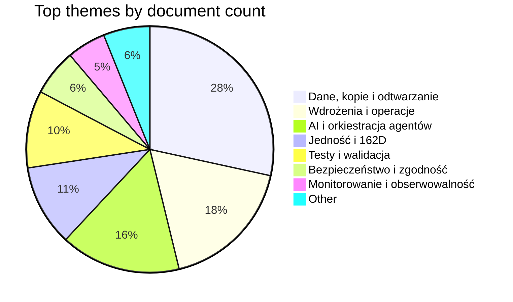
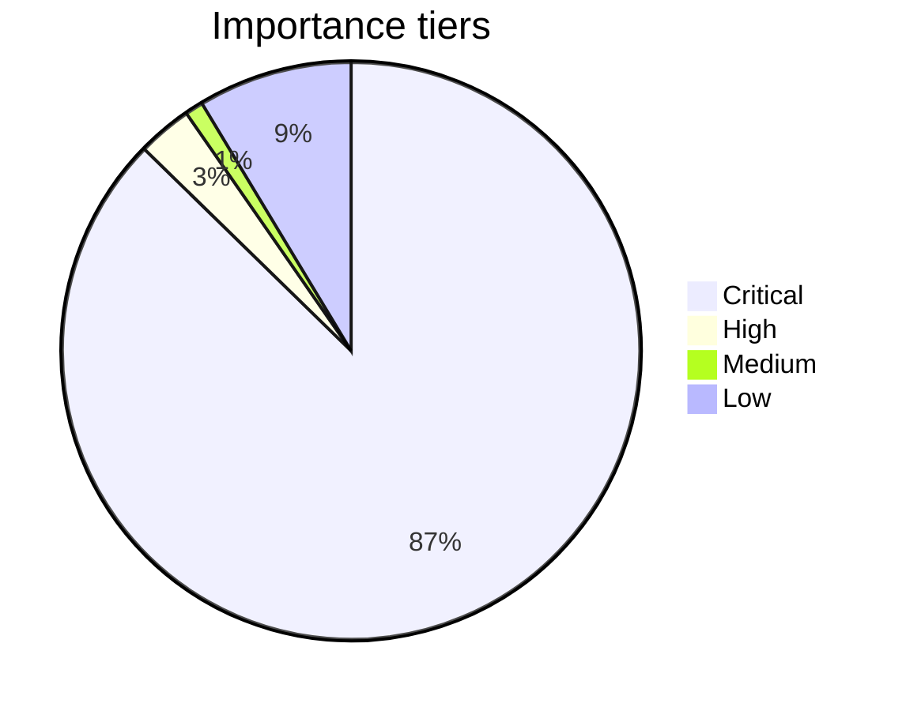

# Knowledge Visuals

Data wygenerowania: 2026-05-09 07:03:54
Zakres: 197 dokumentow w `docs/`.

## Read order

1. Otworz Knowledge Hub.
2. Przejrzyj wykres tematow.
3. Przejdz do mapy tematycznej lub indeksu ważnosci.

## System map

```mermaid
flowchart TD
  A[docs/ Knowledge Base] --> B[KNOWLEDGE_HUB.md]
  B --> C[THEMATIC_INDEX.md]
  B --> D[IMPORTANCE_INDEX.md]
  B --> E[KNOWLEDGE_VISUALS.md]
  C --> Dane_kopie_i_odtwarzanie[Dane, kopie i odtwarzanie (56)]
  C --> Wdro_enia_i_operacje[Wdrożenia i operacje (35)]
  C --> AI_i_orkiestracja_agent_w[AI i orkiestracja agentów (31)]
  C --> Jedno_i_162D[Jedność i 162D (21)]
  C --> Testy_i_walidacja[Testy i walidacja (20)]
  C --> Bezpiecze_stwo_i_zgodno_[Bezpieczeństwo i zgodność (12)]
```

## Theme distribution



## Importance distribution



## Top visual hubs

| Dokument | Temat | Importance | Linki | Słowa |
|---|---|---:|---:|---:|
| [WORKSPACE_STRUCTURE_SCAN_2026-04-08](sessions/WORKSPACE_STRUCTURE_SCAN_2026-04-08.md) | AI i orkiestracja agentów | Critical (87.50) | 0 | 893 |
| [INDEX_QUICK_NAVIGATION](sessions/INDEX_QUICK_NAVIGATION.md) | AI i orkiestracja agentów | Critical (80.08) | 2 | 445 |
| [DEPLOYMENT_SUMMARY](guides/DEPLOYMENT_SUMMARY.md) | Wdrożenia i operacje | Critical (73.50) | 0 | 1153 |
| [SKILLS_INSTALLATION_REPORT_Apr10_2026](sessions/SKILLS_INSTALLATION_REPORT_Apr10_2026.md) | AI i orkiestracja agentów | Critical (69.75) | 0 | 878 |
| [ORACLE_CLOUD_READY](ORACLE_CLOUD_READY.md) | Wdrożenia i operacje | Critical (66.25) | 0 | 960 |
| [GETTING_STARTED](guides/GETTING_STARTED.md) | Dane, kopie i odtwarzanie | Critical (64.25) | 0 | 1147 |
| [COMPLETE_DOCKER_DEPLOYMENT_GUIDE](guides/COMPLETE_DOCKER_DEPLOYMENT_GUIDE.md) | Monitorowanie i obserwowalność | Critical (63.50) | 0 | 958 |
| [SESSION_COMPLETION_REPORT_2026-04-08](sessions/SESSION_COMPLETION_REPORT_2026-04-08.md) | Bezpieczeństwo i zgodność | Critical (63.25) | 0 | 1006 |

## Uwaga

- Diagramy są generowane z heurystyk nazw plikow, sciezki i zawartosci tekstowej.
- Mermaid flowchart jest bezpieczniejszy niz zewnetrzne wykresy i dziala dobrze w Obsidian.